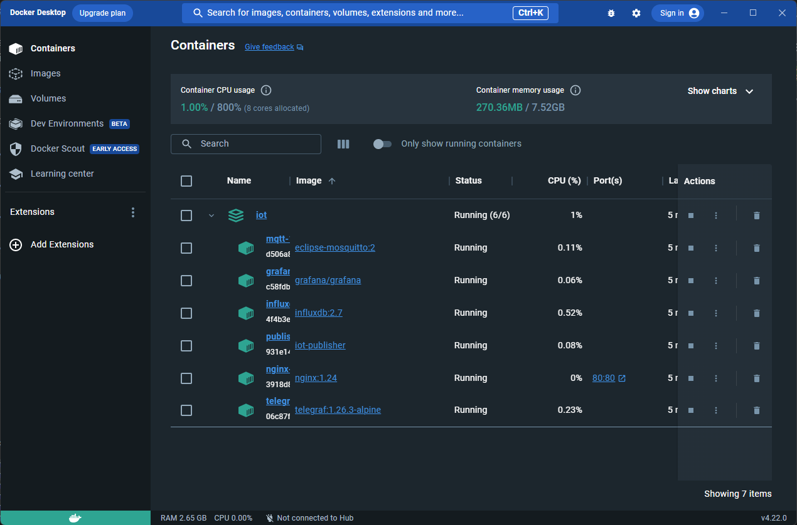
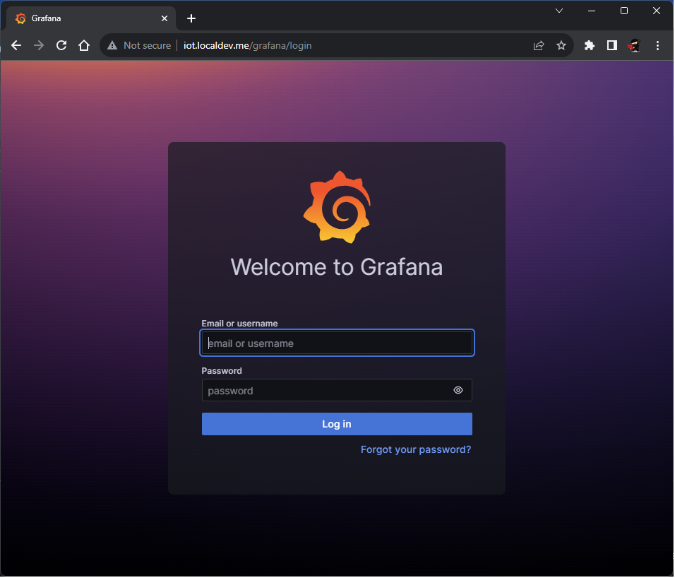
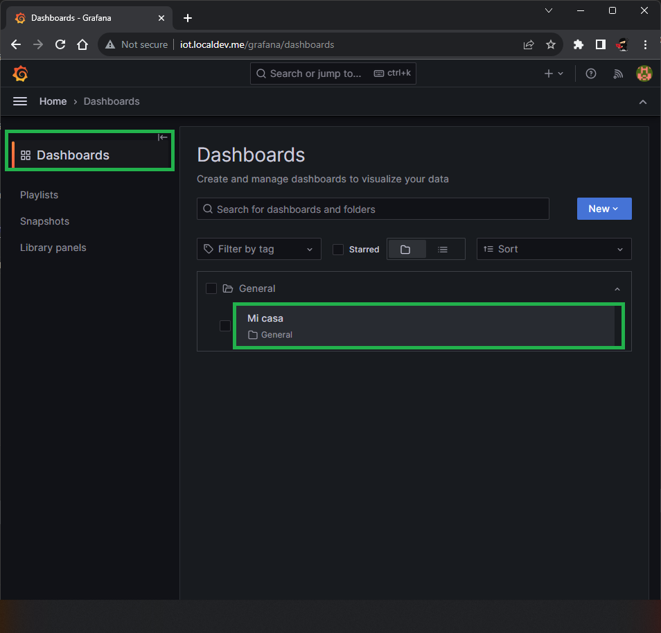
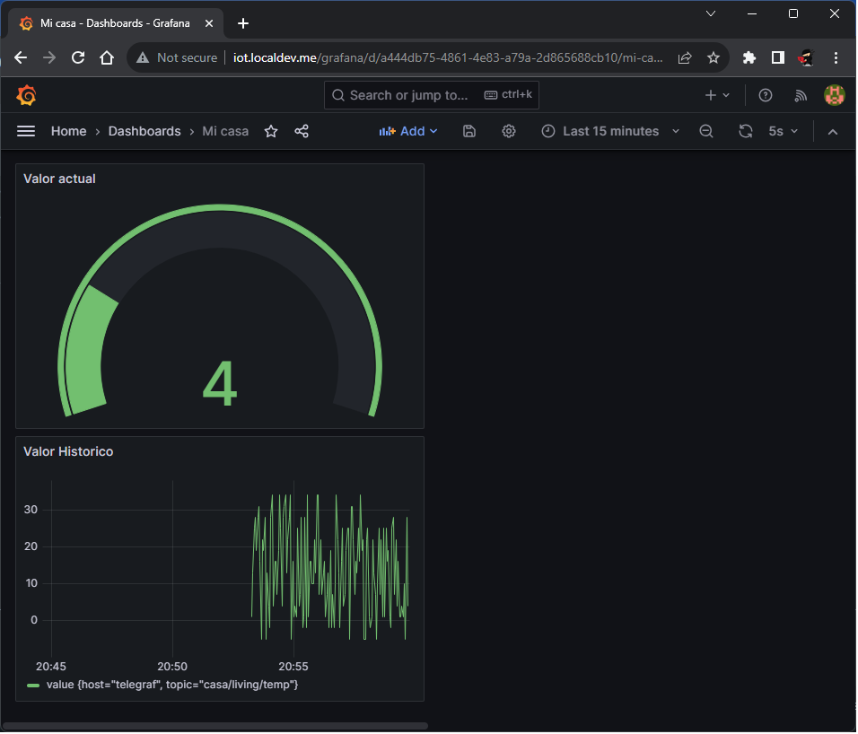

# IoT + Docker Compose

El proyecto realiza el despliegue de una solucion IoT que consta de los siguientes componentes

```mermaid
flowchart LR
    P[NGINX]==>|http://influxdb.localdev.me/| I[(INFLUXDB)]
    P ==> |http://iot.localdev.me/| G(GRAFANA)
    G ==> I
    T[TELEGRAF] ==>|SUBSCRIBE| M
    A[PUBLISHER] ==>|PUBLISH| M(MOSQUITTO)

    T==> |PUSH| I
s
```

## GRAFANA , InfluxDB , MOSQUITTO y Telegraf

- Grafana: Intrface web para generar paneles de control | dashboards conectado a una base de datos InfluxDB

- InfluxDB: Base de datos de serie de tiempo

- Mosquitto : Broker de mensajes que implementa el protocolo MQTT
  adicionalmente una instancia de node-exporter que provee datos de monitoreo de
  hardware

- Telegraf permite integrar MQTT e InfluxDB, basicamente inserta los mensajes de MQTT en la base de datos InfluxDB

- Emulador python: Script de python que sirve para emular carga de dispositivos IoT

- NGINX: Proxy reverso para grafana e influxdb

##

# Requerimientos

Armar un despliegue declarativo (con docker-compose) llamado docker-compose.yaml , almacenado en GitHub que contenga todos los elementos Grafana, InfluxDB y nodeexporter interconectados y configurados.

**Grafana:**

- Versión 9.5.2 [Imagen en Docker Hub](https://hub.docker.com/r/grafana/grafana-oss)

- Configurar todos los parámetros necesarios utilizando variables de entorno

- El despliegue debe incluir el origen de datos o data source a InfluxDB ya definido

**InfluxDB:**

- Deben utilizar una versión compatible con Grafana pero que tenga la mayor cantidad de tiempo de soporte posible [Imagen en Docker Hub](https://hub.docker.com/_/influxdb)

- Los datos deben ser persistidos incluso si se destruye el contenedor

- LOS ARCHIVOS DE BASE DE DATOS NO DEBEN ESTAR PERSISTIDOS EN EL REPOSITORIO GIT

## Utilizacion

Los pasos realizados por la persona evaluadora serán los siguientes

1. Clonar el repositorio git clone `REPO URL`

1. Posicionarse dentro del directorio del repositorio y ejecutar el comando `docker-compose --project-name iot up -d`

1. Esperar que todos los servicios esten levantado (al principio puede tardar un poco)

1. Ingresar a Grafana en http://iot.localdev.me/ usuario `admin` password `admin123`

1. En Grafana ingresar item del menu dashboard al item `General / Mi casa`

Para bajar todos los servicios ejecutar `docker-compose --project-name iot kill` dentro del directorio del repositorio

